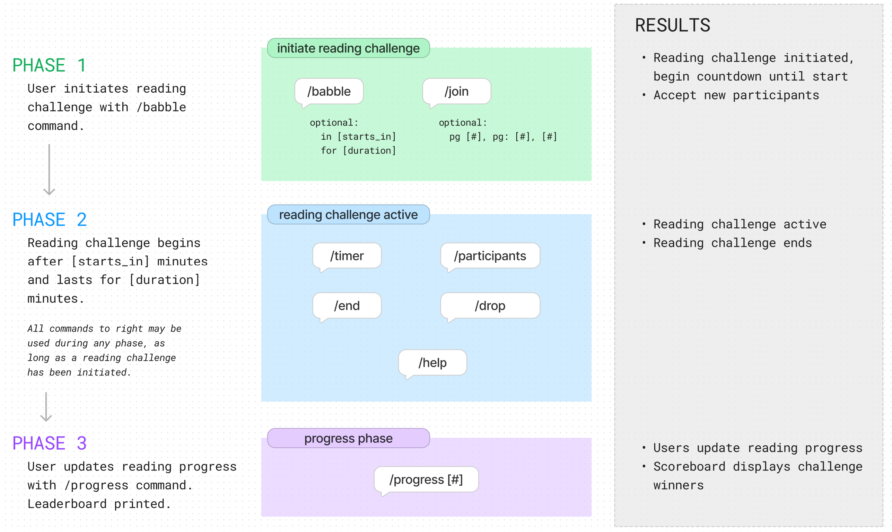

# Babble Bot

## Introduction

Babble Bot is a custom Discord bot designed to facilitate pair reading sessions on Discord servers. It allows members to initiate reading challenges, update their progress, manage existing reading challenges, and engage in friendly competition with other participants. The bot aims to enhance the experience of pair reading by providing a tool that enables users to read together in a fun and competitive environment.

## Features

- Initiate reading challenges with customizable durations
- Join challenges with customizable start points
- Update reading progress
- Drop out of challenges with or without notifying other participants
- Check the remaining time in a session
- View the list of participants

## Tools and Technologies

- **Python 3.11**: The primary programming language for building the bot’s functionality
- **Visual Studio Code**: The integrated development environment used for coding and testing
- **Pytest**: Test framework used to debug and test the code
- **Discord.py**: A Python library used to interact with the Discord API
- **Discord Developer Portal**: Used for API credentials and bot management
- **Datetime and Math Libraries**: Used to manage time-related commands and user rankings
- **Git and GitHub**: Version control tools to track changes in the code

## Installation and Setup

1. Clone the repository: 
        
        git clone https://github.com/katerib/babble-bot.git

2. Navigate into the new directory: 
    
        cd babble-bot

3. Create a virtual environment: 

        python -m venv venv

4. Activate the virtual environment

    Windows: 
        
        venv/Scripts/activate
        
    Mac: 
        
        source venv/bin/activate

5. Install the required packages: 

        pip install -r requirements.txt

6. Copy `.env.example` to create the `.env` file in the root directory:

        cp .env.example .env

    Replace the values for `DISCORD_TOKEN` and `APPLICATION_ID` with your own values.

        DISCORD_TOKEN="token"
        APPLICATION_ID="id"

6. Run the bot: 

        python main.py

## Usage

Initiate a session

    /babble - Use the default values to start a reading challenge in 1 minute that lasts for 30 minutes.
    
    /babble in 5 for 20 - Start a reading challenge in 5 minutes that lasts for 20 minutes.

Join a session

    /join - Allows the user to join a reading challenge starting on page 0.

    /join 10 - Allows the user to join a reading challenge starting on page 10.

Manage a session

    /end - Ends the current session.
    
    /drop - Removes the user from the session without ending the session.
    
    /drop quietly - Removes the user from the session without printing a message to the entire channel and without ending the session.
    
    /timer - Prints the time remaining in the current phase, as outlined in the diagram on the next page.
    
    /participants - Prints a list of all current participants.
    
    /help - Prints a list of all available commands and a short description.

Update progress after reading challenge ends
    
    /progress 50 - Updates user’s reading progress to be used for scoreboard calculations.
